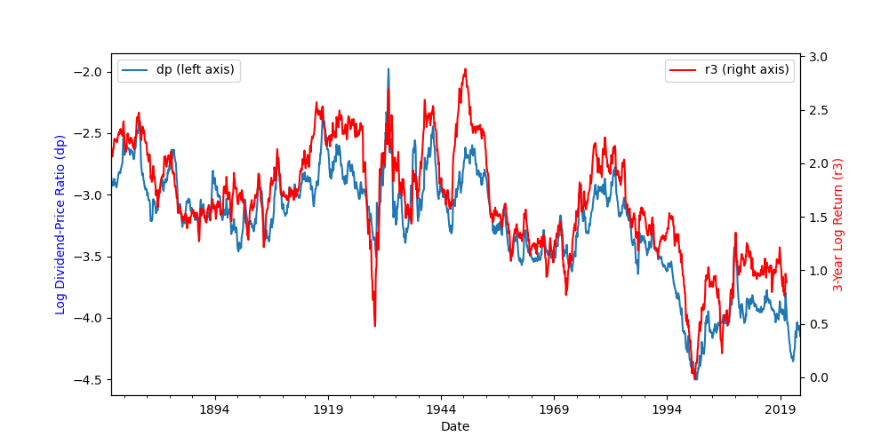
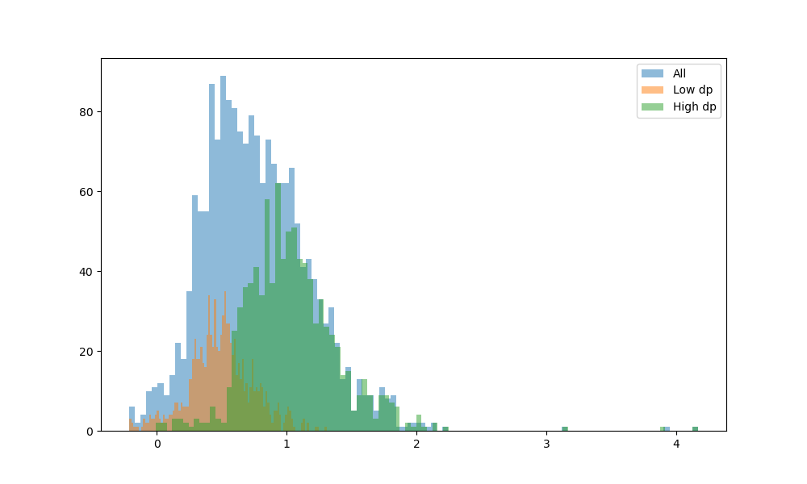

# **Return Predictability: Lessons and Insights for Future Hedge Fund Managers**
## Crash Course - UASM
## August 2025

### Juan F. Imbet 

---
## **Motivation**

If you pick a month at random between 1870 and 2025, how does the compound realized return of the SP500 **one year ahead** look like?

---

---

---
## Guessing the events

- End of Great Recession (1932-06)
- Patient Zero COVID (2019-12)
- Banks Recognise Subprime-related losses (2007-12)
- End of WW1 (1918-11)

---

---
## Business Cycles

What do periods of low/high expected returns have in common?

- Assets seem to be **cheap** when expected returns are high.
- Assets seem to be **expensive** when expected returns are low.
- A ratio of how much an asset is paying (e.g. dividends) vs its price is a good indicator of where in the business cycle we are.
- This applies to all assets, not just stocks, e.g. how much rent you can get from a house vs its price.

---
## **D/P variation over time**

---
## **D/P and 3-year ahead returns**

---
## **How does the D/P capture return variation?**

---
## **Market Efficiency: Overview and Evidence**

- **Animal Spirits** (Keynes, 1936): Prices are driven by irrational behavior and sentiment.
- **Efficient Market Hypothesis** (Fama 1970, Malkiel 1973): Prices in Financial Markets reflect all available information, and returns are unpredictable.
- **Behavioral Finance** (Shiller, 1981): Prices are driven by irrational behavior and sentiment.
- Debate between how ***should*** markets behave (normative) vs how ***do*** markets behave (positive).

---

## **Modern Approach**

- **Efficient Inefficiently** (Pedersen, 2019): The idea that markets are efficient enough to reflect relevant information into prices but inefficient enough to incentivize market participants to gather information and trade.

- Markets do react to new information, but the reaction is not always immediate nor rational.
- If markets were not efficient enough then it would be **easy** to make money. 
- It markets were not inefficient, how do we justify hedge fund fees structure of 2/20? 2% of assets and 20% of profits.

---
## **What do we mean for predictability?**

- **Intuition**: Can we find a variable that helps be right on average on the direction and magnitude of future returns?

- **Formal definition**, conditional vs unconditional expectations.
$$
\mathbb{E}[R_{t\rightarrow t+\tau}|X_t] \neq \mathbb{E}[R_{t\rightarrow t+\tau}]
$$

---
## **How do we search for predictability?**

- **Data**: Data collection vs Data Exhaustion. $\rightarrow$ Market Efficiency.
- **Economic Theory**: What variables should be relevant?
- **Model**: Linear vs Non-Linear $\rightarrow$ Economic Mechanisms vs Spurious Correlations.
- **Backtesting**: Implementation and Transaction Costs.
- **Risk Management**: How to manage the risk of a strategy that is not always profitable?

---
## **Time-Series and Cross-sectional Predictability**

- **Time-Series**: Can you time the market? Can you time an industry? Can you buy low and sell high?
- **Cross-sectional**: Can you pick the best stocks? Can you pick the best industries? Why do some stocks outperform others?

---
## **Why is it predictability important for Hedge Funds?**

- Mandate on generating returns **regardless of market conditions**.
- Flows are extremely sensitive to performance.
- Huge fees, deregulation, and access to financial technology and leverage means that the competition is fierce and expectations are high.
- Access to technology, traders, and real time information: **timing the market**.
- Access to a large universe of assets: **cross-sectional predictability**.

---
## **Simplest Tool, Linear Regression**

Find Signal $X_t$ such that

$$
R_{t\rightarrow t+\tau} = a + \beta X_t + \epsilon_{t\rightarrow t+\tau}
$$

- **$\hat{\beta} \neq 0$**: Predictability, $\mathbb{E}[R_{t \rightarrow t+\tau}] = \hat{a}+\hat{\beta} X_t$
- But what if its just luck? $\rightarrow$ **Significance Testing**.
- Look at standard errors. 

---
## **Out-of-Sample Predictability / Backtesting.**

- Even if $\hat{\beta} \neq 0$, it does not mean that we can make money.
- **Out-of-Sample**: Test the strategy on a different sample.
- It normally requires a **rolling** estimation of the model. 

---
## **Long-term Experiment**

Consider two timing strategies on the SP500, no leverage constraints.
- Buy/short the market if the rolling expected return over the next 3 years is positive/negative.
- Buy/short the market if the rolling expected return predicted by the log dividend price ratio is positive/negative.
- Rule of Thumb of Sharpe Ratios of 3.

---
## **Entire Sample: 1871-2023**

<!-- _backgroundColor: #f0f4f8 -->
| **Strategy** | **Average Return** | **Annual Volatility** | **Approx. Sharpe Ratio** | **Overall** | 
|----------------|------------|-----------|----------------|----------------------|
| Benchmark      | 0.45    | 0.17   | 2.63         | :warning:  |
| Linear Model   | 0.54    | 0.15   | 3.67          | :white_check_mark: |

---
## **Post-war Sample: 1946-2023**

<!-- _backgroundColor: #f0f4f8 -->
| **Strategy** | **Average Return** | **Annual Volatility** | **Approx. Sharpe Ratio** | **Overall** | 
|----------------|------------|-----------|----------------|----------------------|
| Benchmark      | 0.26    | 0.17   | 1.56        | :rotating_light:  |
| Linear Model   | 0.42    | 0.13   | 3.28          | :white_check_mark: |

---
## **1970-2023**

<!-- _backgroundColor: #f0f4f8 -->
| **Strategy** | **Average Return** | **Annual Volatility** | **Approx. Sharpe Ratio** | **Overall** | 
|----------------|------------|-----------|----------------|----------------------|
| Benchmark      | 0.22    | 0.16   | 1.35        | :rotating_light:  |
| Linear Model   | 0.39    | 0.13   | 2.93         | :white_check_mark: |

---
## **1990-2023**

<!-- _backgroundColor: #f0f4f8 -->
| **Strategy** | **Average Return** | **Annual Volatility** | **Approx. Sharpe Ratio** | **Overall** | 
|----------------|------------|-----------|----------------|----------------------|
| Benchmark      | 0.06    | 0.16   | 0.38       | :rotating_light:  |
| Linear Model   | 0.26    | 0.14   | 1.95       | :warning: |

---
## **Predictability works better across shorter samples**

- Expected returns over longer samples capture macroeconomic trends, risk premia, consumption growth, productivity growth, etc.
- Regardless of the source of predictability (risk vs mispricing), its profits tend to diminish over time.
- This is due to the statistical behavior of what we are trying to predict.
- My favorite analogy:  **General Relativity vs Quantum Mechanics**, over long distances/extended periods of time you just follow the laws of physics, but at the micro-level, things get weird.

---
## **More complex relationships**

- **Non-linearities**: Many signals, that are not linearly related to returns.
$$
R_{t\rightarrow t+\tau} = f(X_{1t},X_{2t},\ldots,X_{kt}) + \epsilon_{t\rightarrow t+\tau}
$$
- **Machine Learning**: Can we use more complex models to predict returns?
- **Pros**: Strategies can be more profitable as it can capture more complex relationships.
- **Cons**: Overfitting, Black-box, and lack of economic intuition.
- **Alternative Data**: 
    - Satellite images,
    - Social Media,
    - Credit Card Transactions,
    - Walking patterns

---
## **Does ML work?**

It does if you are careful.

- Evidence across equity markets exploiting **publicly available data**, it is not about gathering additional data but learning from it (Kelly et al. 2020).
- **Retail Investors could benefit from ML**: Publicly available data and ML can help select Mutual Funds with positive alpha (DeMiguel et al. 2023).
- Allows for **in-house** development of strategies that are not available to the general public.

---
<!-- @incremental: true -->

## **Artificial Intelligence and Natural Language Processing**

- So far we have assumed **$X_t$** is a number. <!-- fadeIn -->
- 2023 Q4 Apple Inc's 10-K report contains only 6.91% of numerical characters. <!-- fadeIn -->
- **Natural Language Processing**: Can we extract information from text? <!-- fadeIn -->
    - Companies' reports, <!-- fadeIn -->
    - Central Bank Statements, <!-- fadeIn -->
    - News Articles, <!-- fadeIn -->
    - Earnings Calls. <!-- fadeIn -->
    - Social Media. <!-- fadeIn -->

---
## **Why Text Matters in Investing**

- Much of the information in finance is conveyed through words, not just numbers.
- Words can reveal emotions, intentions, and subtle cues that quantitative data misses.
- Intuition: Like reading between the lines in a business meeting.

---
## **Sentiment Analysis Basics**

- **Sentiment**: The emotional tone behind words – positive, negative, or neutral.
- Algorithms analyze text to score sentiment, similar to how humans judge a conversation.
- Business intuition: A positive tone in a CEO's speech might predict better company performance.

---
## **Text-Based Signals in Practice**

- **Earnings Calls**: The tone of executives can predict stock price movements.
- **News Articles**: Negative coverage often leads to immediate market drops.
- **Social Media**: Public sentiment on platforms like Twitter influences retail trading.

---
## **Challenges with Text Data**

- Text can be ambiguous: sarcasm, irony, or context-dependent meanings.
- Not all information is useful; some is just noise.
- Over-relying on text without combining with numbers can lead to poor decisions.

---
## **Integrating Text into Investment Strategies**

- Combine text signals with traditional financial metrics for better predictions.
- Hedge funds use NLP to gain an edge in timing trades or selecting stocks.
- Intuition: It's like having a translator for the "human" side of markets.

---
## **AI Adoption**

A BarclayHedge survey of 55 hedge fund/CTA professionals

- Q1: Do you utilize a machine learning (artificial intelligence) approach in your investment processes?

---
## **AI Adoption**

- Q2: Which part of your investment process is driven by an application of machine learning techniques? 

---
## **AI Adoption**

- Q5: What are your approximate total strategy assets that utilize machine learning/artificial intelligence (funds and managed accounts)?

---
# **Conclusions**

- **Return predictability exists** and varies systematically with business cycles and market conditions
- **Modern hedge funds** increasingly leverage AI, NLP, and alternative data sources to gain competitive advantages
- **Success requires** combining traditional financial metrics with innovative approaches and rigorous risk management

---
# **Questions?**

Thank you for your attention!