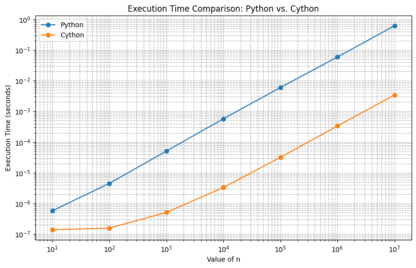
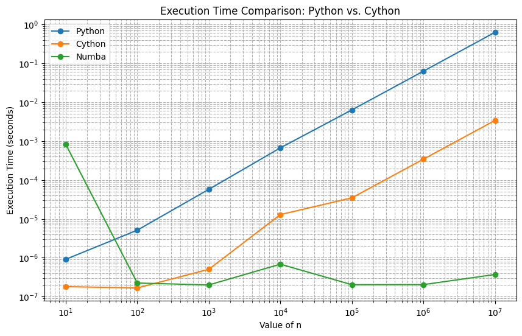
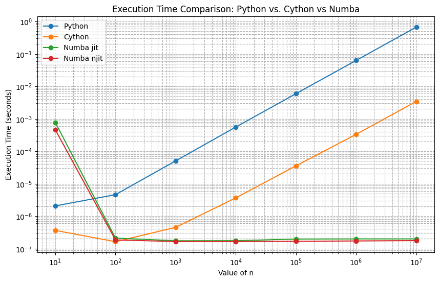

# Some Advanced Topics in Python: Data Validation and Speed.

## Juan F. Imbet Ph.D.

---

## Agenda

- `pydantic`
- `cython`
- `numba`

---
### Some libraries that will appear in the presentation

- `setuptools`: a Python tool used to package, distribute, and install Python projects, making it easier to share and install them as reusable modules or applications.
- `distutils`:  is a core Python library used to distribute and install Python packages, providing basic functionality for packaging projects, but it lacks many of the advanced features found in setuptools, such as dependency management and compatibility with modern packaging standards.

---


---
## `pydantic`

- Using Pydantic can be incredibly beneficial in Python projects where you need to *validate*, *parse*, and *manage* data consistently. 
- It's especially useful when dealing with external data sources, API responses, or user input, as it helps ensure the data conforms to specified structures and types, reducing errors and making the code more readable and maintainable.
- Pydantic is a Python library used for data validation and parsing. It enforces data types and values on Python objects through a class-based approach, making it easy to work with structured data reliably. It leverages Python's type hints.

---
## Why use `pydantic` 

- ***Data Validation:*** Ensures that the data passed to your functions or objects meets the type and structural requirements you've defined.
- ***Data Parsing and Coercion:*** Automatically converts compatible data types, so you don’t have to worry about converting strings to integers or parsing dates.
- ***Type Safety:*** Uses type hints, helping to catch errors early and enhancing code readability.
- ***JSON Serialization:*** Easily converts data models to JSON format, making it useful for APIs and data storage.
- ***Code Clarity and Readability:*** Clearly separates the structure of your data from business logic, making it easier to understand.

---
## Example 1: Basic Model Creation and Validation

Consider a simple model for a `User` with required fields for `id`, `name`, and `email`. Without Pydantic, you’d need to manually check and parse each input to ensure it meets your requirements. With Pydantic, you can define the model structure and it handles the rest.

---
### Without Pydantic

```python
class User:
    def __init__(self, id: int, name: str, email: str):
        if not isinstance(id, int):
            raise ValueError('id must be an integer')
        if not isinstance(name, str):
            raise ValueError('name must be a string')
        if not isinstance(email, str):
            raise ValueError('email must be a string')
        self.id = id
        self.name = name
        self.email = email
```

---
### Without pydantic, but using dataclasses

```python
from dataclasses import dataclass

@dataclass
class User:
    id: int
    name: str
    email: str
```

---
### With Pydantic

`pip install pydantic[email]`

```python
from pydantic import BaseModel, EmailStr

class User(BaseModel):
    id: int
    name: str
    email: EmailStr

user = User(id=1, name="John Doe", email="johndoe@example.com")
print(user)

try:
    invalid_user = User(id="abc", name="Jane", email="not-an-email")
except ValueError as e:
    print(e)
```

---
## Example 2: Data Parsing and Type Conversion

```python
user = User(id="123", name="Alice", email="alice@example.com")
print(user)
```

```output
id=123 name='Alice' email='alice@example.com'
```

---
## Example 3: Nested Models

```python
class Address(BaseModel):
    street: str
    city: str
    zip_code: int

class UserWithAddress(BaseModel):
    id: int
    name: str
    email: EmailStr
    address: Address

address = Address(street="123 Main St", city="New York", zip_code=10001)
user_with_address = UserWithAddress(id=2, name="Jane Doe", email="jane@example.com", address=address)
print(user_with_address)
```

```output
id=2 name='Jane Doe' email='jane@example.com' address=Address(street='123 Main St', city='New York', zip_code=10001)
```

---
## Example 4: JSON Serialization

```python
import json

# Convert model to JSON
user_json = user_with_address.model_dump_json()
print(user_json)

# Load model from JSON
user_dict = json.loads(user_json)
user_from_json = UserWithAddress(**user_dict)
print(user_from_json)
```

```output
{"id":2,"name":"Jane Doe","email":"jane@example.com","address":{"street":"123 Main St","city":"New York","zip_code":10001}}
```
```output
id=2 name='Jane Doe' email='jane@example.com' address=Address(street='123 Main St', city='New York', zip_code=10001)
```

---
### `Fields`

- The `Field` function is used to customize and add metadata to fields of models.
```python
from pydantic import BaseModel, Field
class User(BaseModel):
    name: str = Field(default='John Doe')
```
---

### Numeric Constraints `gt`, `ge`, `lt`, `le`, `multiple_of`, `allow_inf_nan`. 
```python 
from pydantic import BaseModel, Field


class Foo(BaseModel):
    positive: int = Field(gt=0)
    non_negative: int = Field(ge=0)
    negative: int = Field(lt=0)
    non_positive: int = Field(le=0)
    even: int = Field(multiple_of=2)
    love_for_pydantic: float = Field(allow_inf_nan=True)


foo = Foo(
    positive=1,
    non_negative=0,
    negative=-1,
    non_positive=0,
    even=2,
    love_for_pydantic=float('inf'),
)
print(foo)
"""
positive=1 non_negative=0 negative=-1 non_positive=0 even=2 love_for_pydantic=inf
"""
```

---
### `Optional` Fields

```python
from typing import Optional

from typing_extensions import Annotated

from pydantic import BaseModel, Field


class Foo(BaseModel):
    positive: Optional[Annotated[int, Field(gt=0)]]
```

---
### String Constraints

```python 
from pydantic import BaseModel, Field


class Foo(BaseModel):
    short: str = Field(min_length=3)
    long: str = Field(max_length=10)
    regex: str = Field(pattern=r'^\d*$')  


foo = Foo(short='foo', long='foobarbaz', regex='123')
print(foo)
#> short='foo' long='foobarbaz' regex='123'
```

---
### Massive applications

- https://docs.pydantic.dev/latest/
- `pydantic` is used in different applications to automatize the data validation process and the documentation (e.g. APIs). 

---


---

## Cython: An Overview 

What is Cython?
- A programming language designed to make writing C extensions for Python easier.
- Aims to be a ***superset*** of Python with high-level, object-oriented, and functional features.
- ***superset*** just means that all valid Python code is valid Cython code, but Cython adds additional syntax to allow for static type declarations.
Key feature:
- Supports optional static type declarations, allowing translation into optimized C/C++ code

---
## Getting Started

- `pip install Cython`

## Building Cython Code

Cython code must, unlike python, be compiled. This happens in two stages:
- A `.pyx` or `.py` file is compiled by Cython to a `.c` file, containing the code of a Python extension module.
- The `.c` file is compiled by a C compiler to a `.so` file (or `.pyd` on Windows) which can be import-ed directly into a Python session. setuptools takes care of this part. Although Cython can call them for you in certain cases.

---
## The workflow

1. Think about yout function in pure Python.
```python
# example.py
def sum_of_squares(n):
    total = 0
    for i in range(1, n + 1):
        total += i * i
    return total
```
---
2. Write a Cython version of the function. Add type declarations where necessary.
```python
# example.pyx
def sum_of_squares(int n):
    cdef int total = 0
    cdef int i
    for i in range(1, n + 1):
        total += i * i
    return total
```
Here is what is happening:
- `cdef int total`: We declare total as an integer, making it a C integer instead of a Python integer. 
- `cdef int i`: We declare i as an integer, making it a C integer instead of a Python integer.

---
3. Compile the Cython code

```python 
# setup.py
from setuptools import setup
from Cython.Build import cythonize

setup(
    ext_modules=cythonize("example.pyx")
)
```

- `python setup.py build_ext --inplace`

---
### Output 

- A file called `example.c` will be created in the same directory as `example.pyx`.
- A `.pyd` file will be created in the same directory as `example.pyx`.

### Test it 

```python
from example import sum_of_squares

# Test the function with a large number
print(sum_of_squares(100))
```

Do you get a negative number when `n` is too large? This is because the result is too large to fit in a 32-bit signed integer.

---
## Modify and compile again

```python
# example.pyx
def sum_of_squares(int n):
    cdef long long total = 0
    cdef int i
    for i in range(1, n + 1):
        total += i * i
    return total
```

---
## Performance Gain

```python 
from example import sum_of_squares as sum_of_squares_cython

def sum_of_squares(n):
    total = 0
    for i in range(1, n + 1):
        total += i * i
    return total

%timeit sum_of_squares(1000)
%timeit sum_of_squares_cython(1000)
```

```output
50.4 μs ± 3.15 μs per loop (mean ± std. dev. of 7 runs, 10,000 loops each)
389 ns ± 3.14 ns per loop (mean ± std. dev. of 7 runs, 1,000,000 loops each)
```
---
## Speedup



---

# Can we do better? `Numba`


---

- Numba is a just-in-time (JIT) compiler that translates Python functions to optimized machine code at runtime using the industry-standard LLVM compiler library.
- LLVM (Low-Level Virtual Machine) is a compiler infrastructure that provides a collection of modular and reusable compiler and toolchain technologies.

---
# Example

```python
from numba import jit

@jit
def sum_of_squares_numba(n):
    total = 0
    for i in range(1, n + 1):
        total += i * i
    return total
```

---
## What is happening behind the scenes?

- By adding @jit decorators, Numba can automatically compile Python functions to machine code, taking advantage of the CPU's vectorized instructions.

---
## Performance Gain



---
### Can we do better? Slighty, no python in `@jit`

```python
from numba import njit
```



---
## Parallelization in the compiler. Exploit `numpy` and `numba`


- Numba offers a range of options for parallelizing your code for CPUs and GPUs, often with only minor code changes
- Automatic multi-threading: NumPy array expressions have a significant amount of implied parallelism, as operations are broadcast independently over the input elements. ParallelAccelerator can identify this parallelism and automatically distribute it over several threads. All we need to do is enable the parallelization pass with `parallel=True`

---
### Example: Gaussian Kernel

`@jit(nopython=True) == @njit`

```python
SQRT_2PI = np.sqrt(2 * np.pi)

@jit(nopython=True, parallel=True)
def gaussians(x, means, widths):
    '''Return the value of gaussian kernels.
    
    x - location of evaluation
    means - array of kernel means
    widths - array of kernel widths
    '''
    n = means.shape[0]
    result = np.exp( -0.5 * ((x - means) / widths)**2 ) / widths
    return result / SQRT_2PI / n
```

---

### Testing

```python
means = np.random.uniform(-1, 1, size=1000000)
widths = np.random.uniform(0.1, 0.3, size=1000000)

gaussians(0.4, means, widths)
```

### Parallelized vs Non-Parallelized

```python
gaussians_nothread = jit(nopython=True)(gaussians.py_func)

%timeit gaussians_nothread(0.4, means, widths)
%timeit gaussians(0.4, means, widths)
```

```output
9.62 ms ± 181 μs per loop (mean ± std. dev. of 7 runs, 1 loop each)
2.03 ms ± 51.1 μs per loop (mean ± std. dev. of 7 runs, 100 loops each)
```

---
### Comparison with pure `numpy`

`%timeit gaussians.py_func(0.4, means, widths) # compare to pure NumPy`

` 22.9 ms ± 808 μs per loop (mean ± std. dev. of 7 runs, 10 loops each)`

The performance ratio depends on the number of CPUs in your system, but the multithreaded version is definitely faster than the single threaded version.

---
## Multithreading with `prange()`

- There are other situations where you would like multithreading, but do not have a straightforward array expression. In those cases, using prange()

Example: Approximating Pi in a square. 
- We can approximate the value of π by randomly sampling points in a square and counting the fraction of points that fall within a quarter circle inscribed in the square.

---
## Example

```python 
import random

# Serial version
@jit(nopython=True)
def monte_carlo_pi_serial(nsamples):
    acc = 0
    for i in range(nsamples):
        x = random.random()
        y = random.random()
        if (x**2 + y**2) < 1.0:
            acc += 1
    return 4.0 * acc / nsamples
```

---
```python
# Parallel version
@jit(nopython=True, parallel=True)
def monte_carlo_pi_parallel(nsamples):
    acc = 0
    # Only change is here
    for i in numba.prange(nsamples):
        x = random.random()
        y = random.random()
        if (x**2 + y**2) < 1.0:
            acc += 1
    return 4.0 * acc / nsamples
```

---
```python
%timeit monte_carlo_pi_serial(int(4e8))
%timeit monte_carlo_pi_parallel(int(4e8))
```

```output
4.04 s ± 39.9 ms per loop (mean ± std. dev. of 7 runs, 1 loop each)
260 ms ± 4.52 ms per loop (mean ± std. dev. of 7 runs, 1 loop each)
```

---
### Further Reading

- SIMD (Single Instruction, Multiple Data) vectorization: Numba can automatically vectorize your functions to take advantage of SIMD instructions on modern CPUs.
- CUDA: Numba can compile Python functions to run on NVIDIA GPUs using CUDA.

---
# Libraries for the curious

***DataFrames***: When you have too much data.
- `dask`: Dask is a flexible parallel computing library for analytics. 
- `polars`: Polars is a blazingly fast DataFrame library implemented in Rust and leveraging Apache Arrow.

---
# Libraries for the curious

***Create your own programming language***:
- `llvmlite`: A lightweight LLVM python binding for writing JIT compilers.
- `rply`: A pure Python parser generator inspired by PLY (Python Lex-Yacc).
- `sly`: Sly (Sly Lex Yacc) is a Python implementation of the lex and yacc tools for constructing scanners and parsers.

---
# Libraries for the curious

***Large Language Models***:
- `transformers`: Created by the team at Hugging Face, Transformers provides thousands of pre-trained models for natural language processing (NLP) tasks.

---
# Libraries for the curious

***Game Development***:
- `pygame`: Pygame is a set of Python modules designed for writing video games.
- `arcade`: Arcade is an easy-to-learn Python library for creating 2D video games.


