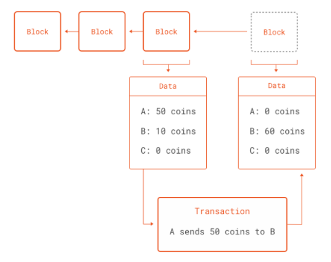
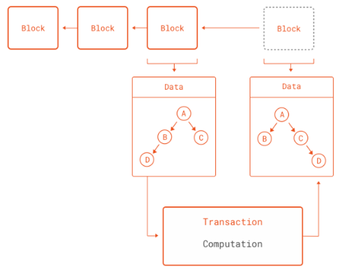

# Introduction to Blockchain using Python

## Juan F. Imbet *Ph.D.*

### Paris Dauphine University - PSL

---

## What is a Blockchain?

- A blockchain is a shared ***ledger*** of transactions between parties in a network not controlled by a single central authority. 
- You can think of a ledger like a record book: it records and stores all transactions between users in chronological order. 
- Instead of one authority controlling this ledger (like a bank), an identical copy of the ledger is held by all users on the network, called ***nodes***. 

---

## Structure of a Blockchain Block

- Each block in a blockchain contains:
    - ***Data***: Details of transactions (e.g., sender, receiver, amount).
    - ***Previous Hash***: A reference to the hash of the previous block.
    - ***Hash***: A unique fingerprint for the current block.
    - ***Timestamp***: The time when the block was created.
- Blocks are linked together by their hashes, forming a chain.

---

## How Does Blockchain Ensure Security?

- Blockchain uses ***cryptographic hashing*** to secure data.
- A hash function takes input data and produces a fixed-size alphanumeric string.
- Even a slight change in the input produces a completely different hash.
- This makes it nearly impossible to alter the data without being detected.

---

## Consensus Mechanisms

- In a blockchain, all nodes must agree on the validity of transactions.
- Two popular consensus mechanisms are:
    - ***Proof of Work (PoW)***: Solving complex mathematical puzzles to validate transactions.
    - ***Proof of Stake (PoS)***: Validators are chosen based on the number of coins they hold and are willing to "stake" as collateral.
- Consensus ensures that the blockchain remains consistent across all nodes.

---

## Centralised vs. Decentralised Ledgers


---
## How does the ledger look like?

- All copies of one document are spread among users and they are constantly and automatically synchronised, hence identical at all times. 
- The ledger is a list of all transactions that consist of a chain of blocks. 
- A block is comprised of a group of transactions from the same time period, like a page from a record book.
- Blocks have a unique ID represented as the hash of its own code (or something that makes them unique). 
- Along with its own hash, each block stores the hash of the block before it. 

---
## Hash 

- A hash is a unique string of letters and numbers created from text using a mathematical formula. Blocks are therefore “chained” together making the ledger (almost) immutable or unable to be changed. To add a block, it may first need to be mined and then approved by a number of notes through a consensus mechanism.


---
## How does a block in a blockchain look like? E.g. Ethereum (a test network)

```bash
pip install web3
pip install "web3[tester]"
```

```python 
from web3 import Web3, EthereumTesterProvider
w3 = Web3(EthereumTesterProvider())
w3.is_connected()
```

```bash 
True
```

---
## Retrieving the latest block 

```python 
last_block = w3.eth.get_block('latest')
type(last_block)
```
The interface provides a data structure that `inherits` from a dictionary. 
```bash
<class 'web3.datastructures.AttributeDict'>
```

---
## Block attributes

Pretty print the block attributes to a file
    
```python
import pprint
with open('block.txt', 'w') as f:
    pprint.pprint(last_block.keys(), f)
```

---

## Peak 

```bash 
KeysView(
    AttributeDict(
        {'number': 0, 
        'hash': HexBytes('0x3351c94e692da67b54613efa25fd3a9a74ec4a7ba362c6815e628496cbe93523'), 
        'parentHash': HexBytes('0x0000000000000000000000000000000000000000000000000000000000000000'), 
        'nonce': HexBytes('0x0000000000000000'), 
        'sha3Uncles': HexBytes('0x1dcc4de8dec75d7aab85b567b6ccd41ad312451b948a7413f0a142fd40d49347'), 
        'logsBloom': HexBytes('0x00'), 
        'transactionsRoot': HexBytes('0x56e81f171bcc55a6ff8345e692c0f86e5b48e01b996cadc001622fb5e363b421'), 
        'receiptsRoot': HexBytes('0x56e81f171bcc55a6ff8345e692c0f86e5b48e01b996cadc001622fb5e363b421'), 
        'stateRoot': HexBytes('0xf1588db9a9f1ed91effabdec31f93cb4212b008c8b8ba047fd55fabebf6fd727'), 
        'miner': '0x0000000000000000000000000000000000000000', 
        'difficulty': 0, 
```

---

## Get the real one 

- If we're interested in getting all blocks from genesis, we'll need to communicate with an Archive node. 
- At the current time of this writing, the full state of the Ethereum blockchain takes around 10,000 GB of storage (~11TB). 
- Luckily, we don't need to manage this infrastructure ourselves, and we can use QuickNode (or another provider) to boot up an Archive node. 

---

## Further Reading (you need to sign up)

- https://www.quicknode.com/guides/ethereum-development/transactions/how-to-fetch-transaction-history-on-ethereum-using-web3py

---

## Different Types of Blockchains

| | | | READ | WRITE | COMMIT | EXAMPLE |
| --- | --- | --- | --- | --- | --- | --- |
| | OPEN | Permissionless | Anyone | Anyone | Anyone | Bitcoin, Ethereum |
| | OPEN | Permissioned | Anyone | Authorised participants | Subset of participants | Supply chain  | 
| | CLOSED | Consortium | Authorised participants| Authorised participants| Authorised participants| Shared Banking |
| | CLOSED | Private Permissioned | Authorised participants| Network operator| Network operator| Shared Banking |

---
## The Layers of Blockchain

- Because blockchains work as a distributed database, they can also work as a distributed computing system. 
- **Protocol Layer**: The rules that govern the network.
- **Network Layer**: The network of nodes that communicate with each other.
- **Application Layer**: The applications that run on top of the network.

---

## Characteristics of Blockchain
- ***Distributed***: The main ledger is maintained and held by all nodes in the network. No central authority holds or updates the ledger, rather each node independently constructs its own record by processing every block, deciding if its valid, and voting via the consensus mechanism on their conclusion. 
- ***Immutable***: Once a block is added to the chain, it cannot be altered. This is because each block contains a hash of the previous block, so if a block is altered, the hash of the block will change, and the chain will be broken.

---

## Characteristics of Blockchain

- **Agreed by consensus**: No block can be added to the ledger without approval from specified nodes in the network. 
- Rules regarding how this consent is collected are called consensus mechanisms. 
- Consensus protocols are crucial in ensuring that every block is valid and that all participants agree and maintain the same version of the ledger.

---
### Missconceptions

- ***Pseudonymous***: Blockchain does not allow its users to be totally anonymous. User identities are anonymous but their accounts are not, as all of their transactions are visible to all other users. 

---

## Mining 
- For some blockchains, in order to add blocks to the ledger, transfers must go through a mining process. 
- Mining is a way of adding transaction records, via blocks, onto a public ledger. 
- Miners are nodes in the network that ensure the transactions in the block are valid. 
- Specifically, they ensure that senders have not already used the funds they want to send to receivers. 
- Once miners finish the verification, they have to ask the network for consent to add the new block to the ledger.
- In order to do so, they have to follow the consensus mechanisms chosen for the platform. 

---
### Consensus 

- Agreement among the nodes regarding the "state" of the ledger is essential for the function of the blockchain ledger. 
- The bitcoin blockchain uses a consensus model called Proof of Work, which requires the miner to compete against other miners to create and broadcast blocks for approval. 
- Proof of work (PoW) describes a system that requires a not-insignificant but feasible amount of effort in order to deter frivolous or malicious uses of computing power, such as sending spam emails or launching denial of service attacks.

---
## Example of PoW
- PoW requires nodes on a network to provide evidence that they have expended computational power (i.e. work) in order to achieve consensus in a decentralized manner and to prevent bad actors from overtaking the network. 
- The work itself is arbitrary. For Bitcoin, it involves iterations of SHA-256 hashing algorithms.
- Proof of work requires a computer to randomly engage in hashing functions until it arrives at an output with the correct minimum amount of leading zeroes. 
- For example, the hash for block #660000, mined on December 4, 2020 is 00000000000000000008eddcaf078f12c69a439dde30dbb5aac3d9d94e9c18f6. The block reward for that successful hash was 6.25 BTC. 

---

## Digital Assets 

- ***Tokens*** Tokenization describes the process of transferring rights from a real world asset into a digital representation – or token – on the blockchain. Being in possession of that digital token then gives you the right to that asset and the ability to trade and track it digitally. 

---
### Types of digital assets

- Payment tokens: Commonly referred to as cryptocurrencies, these tokens are used as a medium of exchange and store of value.
- Utility tokens: These tokens are used to access a specific product or service. (similar to a gift card)
- Security tokens: These tokens represent ownership of an asset, such as real estate or company shares.

---
### Relevance in Finance (Banking)

- Banks are essential intermediaries for financial transactions. In many cases, they represent the only trusted third party. 
- However given the bank stores all data on a single centralised ledger, it therefore creates a single point of failure, whereby hackers or malicious actors can direct all their efforts for cyberattacks or manipulation to this specific entity. 

---

## Blockchain beyond traditional finance. 

- ***Due diligence in supply chains:*** Distributed ledgers can be used to track the provenance of goods, ensuring that they are ethically sourced and produced. Consumers could scan a QR code on a product to see its entire journey from production to sale (e.g. see really what's in your McDonald's chicken nuggets).
- **Healthcare**: Provide more robust patient healthcare information across hospitals, clinics, and pharmacies.
- **Energy**: Decentralised peer-to-peer energy trading, allowing consumers to buy and sell energy directly from each other.

---

## Ethereum: A Programmable Blockchain

- Although the concept of the blockchain was born out of the research into cryptocurrencies, they are much more powerful than just that.
- Blockchain essentially encodes one thing: state transitions. Whenever someone sends a coin in Bitcoin to someone else, the global state of the blockchain is changed.Moreover, it provides a crypographically secure way to performing these updates in the ledger.
- An interesting way to think of a blockchain is as a never-halting computation: new instructions and data are fetched from a pool, the pool of unconfirmed transactions. Each result is recorded in the blockchain, which forms the state of the computation. Any single snapshot of the blockchain is the state of the computation at that point.

---
### Transactions as computations



---
### Blockchains and software
- All software systems deal in some way or another with state transitions. So what if we could generalize the state transitions inside a blockchain into any software we could think of. 
- Blockchains deal with reaching consensus for decentralized computations, it does not matter what those computations are. And this is exactly what the Ethereum network brings to the table: a blockchain that can perform any computation as part of a transaction.

---
## Transactions as computations 



---
## What computations make sense? Examples:
- Secure deposits that get returned to the payer if conditions are met (or not).
- Money that cannot be spent unless a certain number of users agree to spending it.
- Money that can only be spent after producing external data that satisfies rules set. 

---
### Some Technical Details

- Ethereum is ***Turing complete***, meaning that it can run any computation that can be expressed in code.
- A ***Turing complete*** system is one that can solve any computational problem given enough time and memory.
- Every machine capable of running a ***Turing complete language*** has one big problem: ***The Halting Problem***.

---
### The Halting Problem

- Formulated by Alan Turing in 1936, the Halting Problem is a fundamental problem in computer science.
- It states that it is impossible to determine generally whether a program will halt (stop running) or run forever.
- Its proof is related to the incompleteness theorem of Gödel, which states that there are true statements that cannot be proven. It is also related to the Entscheidungsproblem, which is the problem of deciding whether a given statement is provable from an axiomatic system.

---
## Why is the Halting Problem important for Programmable Blockchains?

- A malicious actor could create some *code* in the blockchain that never halts, consuming all the resources of the network.

---

## Ether

- Although Ethereum brings general computations to the blockchain, it still uses a "coin". 
- Since computation is costly, and it is in fact rewarded by giving nodes that produce blocks ether, what better way to limit computations than by requiring ether for running them. 
- Thus Ethereum solves the problem of denial of service attacks through malicious (or bugged) scripts that run forever. Every time a script is run, the user requesting the script to run must set a limit of ether to spend in it.

---

## Smart Contracts

- Smart contracts are the key element of Ethereum. In them any algorithm can be encoded. Smart contracts can carry arbitrary state and can perform any arbitrary computations. They are even able to call other smart contracts. This gives the scripting facilities of Ethereum tremendous flexibility. 
- When a block is created, in contrast to Bitcoin, Ethereum follows a different pattern for selecting which blocks get added to the valid blockchain. 
- For consensus, Ethereum follows a protocol called GHOST, (Greedy Heaviest Observed Subtree). 
- An important aspect of how smart contracts work in Ethereum is that they have their own address in the blockchain. In other words, contract code is not carried inside each transaction that makes use of it. This would quickly become unwieldy. Instead, a node can create a special transaction that assigns an address to a contract.

---
## Apps on Ethereum (DApps)

- No Owners: Once deployed to Ethreum, dapp code can't be taken down. And anyone can use the dapp's features. Even if the team behind the dapp disbanded you could still use it. Once on Ethereum, it stays there. 
- Free from censorship: No body can be blocked from using a dapp or submitting transactions. If Twitter was on Ethereum no one could block an account. 
- Built-in payments: Ethereum uses by default ETH payments.
- Open Source: Most code is maintained and tested by large communities. 
- Anonymous Login: Your Ethereum wallet (account) is the login.
- Safer than current Web applications: Protocols backed with stronger cryptography.
- No down time: An app will only go down if Ethereum goes down. 

---
## How dapps work 

- Dapps have their backend code (smart contracts) running on a decentralized network and not a centralized server. They use the Ethereum blockchain for data storage and smart contracts for their app logic.
- A smart contract is like a set of rules that live on-chain for all to see and run exactly according to those rules. Imagine a vending machine: if you supply it with enough funds and the right selection, you'll get the item you want. And like vending machines, smart contracts can hold funds much like your Ethereum account. This allows code to mediate agreements and transactions.

---
## Dapps and Web 3.0

- Web 1.0: Internet used for sharing information through the http protocol. Few information providers to a growing audience. Mostly static content. 
- Web 2.0: Ability to let users share and modify data. Success for large tech companies e.g. Google, Amazon, Airbnb...
- Web 3.0: Internet applications running on a block-chain. Less reliance on large database and server providers. The front end of these applications are very similar to modern web applications (except authentication),while the backend uses smart-contracts as their "programming language", usually coded in a programming language called Solidity. 

---

## NFTs

- Non-fungible tokens (NFTs) are a type of digital asset that represents ownership or proof of authenticity of a unique item or piece of content using blockchain technology.
- Unlike cryptocurrencies, they cannot be traded or exchanged at equivalency.
- NFTs can also be used to represent individuals' identities, property rights, and more.
- Much of the current market for NFTs is centered around collectibles, such as digital artwork, sports cards, and rarities.
- Applications outside finance, e.g. Passports, academic credentials, tickets, and voting (more secure than the current electronic voting). 


---
## Solidity (for the curious reader)

- Solidity is a statically-typed programming language designed for developing smart contracts that run on the Ethereum Virtual Machine (EVM).
- It is influenced by C++, Python, and JavaScript and is designed to target the EVM.
- https://soliditylang.org/

---

## Example using Python
### Blockchain as a data structure. 

---

## The `hashlib` module

- Python's `hashlib` module provides a common interface to many secure hash and message digest algorithms.
- It is part of the `cpython` standard library and is used to generate secure hashes of data. (C++ code that can be called directly from Python).
- SHA- is a family of cryptographic hash functions, each with a different bit length. SHA-256 is a 256-bit hash function that is widely used in blockchain technology.

---
## The SHA algorithms

- Developed by the National Security Agency (NSA) in the United States, the Secure Hash Algorithms are a family of cryptographic hash functions. Published by the National Institute of Standards and Technology (NIST) as a U.S. Federal Information Processing Standard (FIPS), the algorithms are used to secure data and ensure its integrity.
- The whole idea behind is to make a function that is easy to compute in one direction but hard (almost impossible) to reverse.
- One consequence of this is that the function is highly discontinuous, meaning that a small change in the input will result in a large change in the output.

---
## Implementation in python

```python
import hashlib
has = lambda x: hashlib.sha256(x.encode()).hexdigest()
has('hello')
has('helo')
```
```output
'2cf24dba5fb0a30e26e83b2ac5b9e29e1b161e5c1fa7425e73043362938b9824'
'f4e454f802b88d2f64168ff1742e8cf413fd677d38b87cbefb45821f8981b912'
```

---

## Application: Building a Simple Blockchain

- We will build a simple blockchain in Python with the following structure:
    - Define a `Block` class that contains data, previous hash, timestamp, and hash.
    - Define a `Blockchain` class that manages a list of blocks.
    - Add functionality to create new blocks and validate the integrity of the blockchain.

---

## Python Code: Block Class

```python
import hashlib
import time
from dataclasses import dataclass, field

@dataclass
class Block:
    data: str
    previous_hash: str = ''
    timestamp: float = field(default_factory=time.time)
    hash: str = field(init=False)

    def __post_init__(self):
        # Automatically calculate the hash after initialization
        self.hash = self.calculate_hash

    @property
    def calculate_hash(self):
        return hashlib.sha256(
            (str(self.timestamp) + self.data + self.previous_hash).encode()
        ).hexdigest()
```
---
Explanation:

- `@dataclass`: This decorator automatically generates the `__init__`, `__repr__`, and other methods based on the class attributes.
- `field()`: Used for `timestamp` with `default_factory` to set its default value to the current time.
- `init=False`: For the hash field, so it isn't required during initialization and is computed in `__post_init__`.
`__post_init__()`: A special method in dataclasses that runs immediately after the object is initialized, used here to calculate the hash.


---

## Python Code: Blockchain Class

```python
from dataclasses import dataclass, field

@dataclass
class Blockchain:
    chain: list = field(default_factory=list)

    def __post_init__(self):
        # Initialize the chain with the genesis block
        self.chain.append(self.create_genesis_block())

    def create_genesis_block(self):
        return Block('Genesis Block', '0')

    def add_block(self, data: str):
        previous_block = self.chain[-1]
        new_block = Block(data, previous_block.hash)
        self.chain.append(new_block)
```

---

## Verifying Blockchain Integrity

- To verify the integrity of a blockchain:
    - Iterate through the chain.
    - Check if each block's `previous_hash` matches the `hash` of the preceding block.
    - If any mismatch is found, the blockchain is compromised.

```python
def is_chain_valid(self):
    for i in range(1, len(self.chain)):
        current_block = self.chain[i]
        previous_block = self.chain[i - 1]
        if current_block.previous_hash != previous_block.hash:
            return False
    return True
```

---

