# Optimization using Solver

## Juan F. Imbet *Ph.D.*

### Paris Dauphine University - M203 (M1)

---

## Optimization

### Notation and Definitions

- **Optimization**: The process of finding the minimum (or maximum) value of a function subject to a set of constraints.
- **Objective function**: The function to be minimized or maximized.
- **Decision variables**: The variables that can be adjusted to optimize the objective function.
- **Constraints**: The limitations on the decision variables.

---

## ***Easy*** Optimization: Convex Optimization

### Convex Optimization

- **Convex function**: A function that has a non-negative second derivative.
- **Convex set**: A set where the line segment between any two points in the set lies entirely within the set.
- Minimization of a convex function over a convex set is a convex optimization problem. These problems are easy to solve because they have a single global minimum.

---
## Example: Linear Programming

### Linear Programming

- **Objective function**: A linear function.
- **Constraints**: Linear inequalities.
- **Decision variables**: Continuous.
- **Optimization**: Minimize or maximize the objective function.

---
# Linear Programming Problem: Investment Portfolio Optimization

You are managing an investment portfolio and have two options for investment:

- **Investment A**: This is a low-risk investment with a 5% return.
- **Investment B**: This is a higher-risk investment with a 10% return.

Your goal is to maximize the return on your investment, but there are constraints:

- The total amount available to invest is $100,000.
- You decide that no more than 60% of the total investment should be in the higher-risk investment (Investment B).
- Due to diversification, you want to invest at least $40,000 in Investment A.

---

## Decision Variables:
Let:

- $x_1$ be the amount invested in Investment A.
- $x_2$ be the amount invested in Investment B.

## Objective Function (Maximize total return):
$$
\text{Maximize } Z = 0.05x_1 + 0.10x_2
$$

---

## Constraints:
1. Total amount invested:
$$
x_1 + x_2 \leq 100,000
$$

2. Limit on investment in higher-risk option:
$$
x_2 \leq 0.60(x_1 + x_2)
$$
(This simplifies to $x_2 \leq 60,000$.)

---

3. Minimum investment in Investment A:
$$
x_1 \geq 40,000
$$

4. Non-negativity constraints:
$$
x_1 \geq 0, \quad x_2 \geq 0
$$

---

## Linear Programming Formulation:
$$
\text{Maximize } Z = 0.05x_1 + 0.10x_2
$$

Subject to:
$$
x_1 + x_2 \leq 100,000
$$

$$
x_2 \leq 60,000
$$
$$
x_1 \geq 40,000
$$
$$
x_1 \geq 0, \quad x_2 \geq 0
$$

---

## Using Excel's Solver

- Installation: Go to `File > Options > Add-ins`.
- IN `Manage:` select `Excel Add-ins` and click `Go`. Install `Solver Add-in`.

---
## Using Excel's Solver

- Define the parameters of the model in cells. 

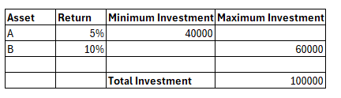

---
## Define the objective function and constraints as formulas in Excel.

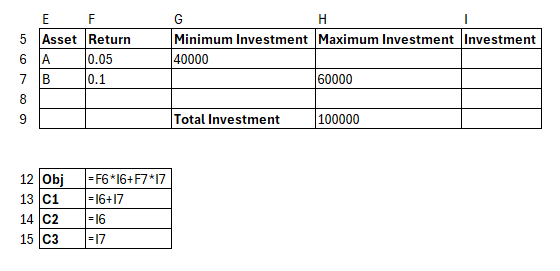

---

## Solver: `Data > Solver`

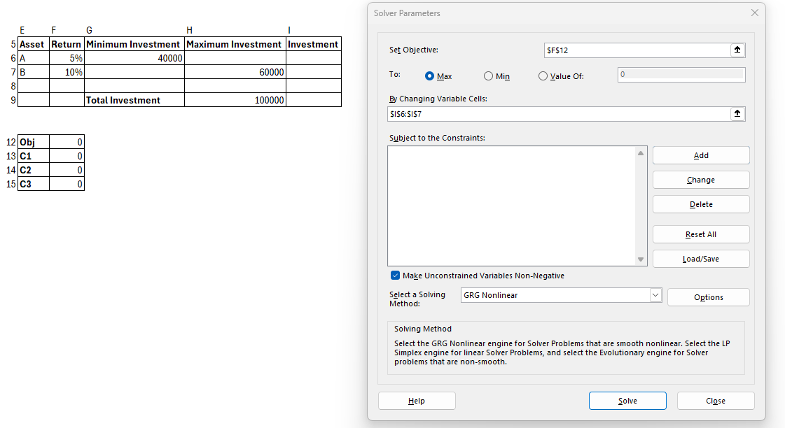


---

## Constraints

Click `Add` to add the constraints.

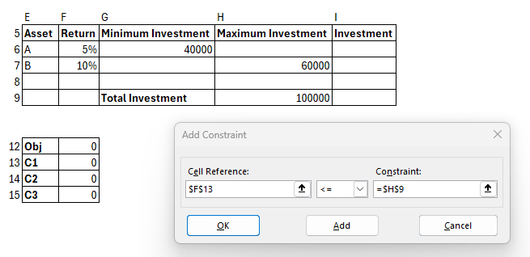

---

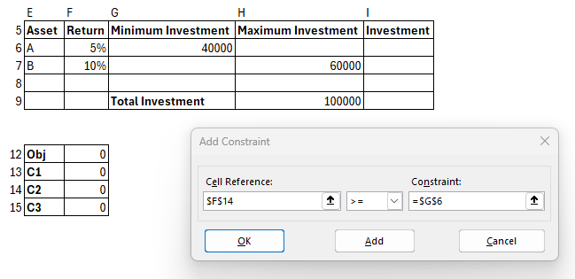

---

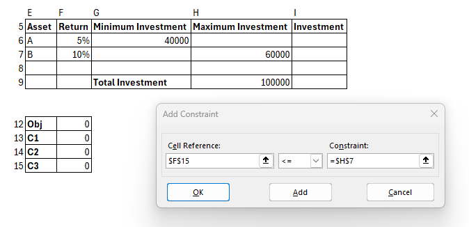

---

- For bounds $x_1 \geq 0$ and $x_2 \geq 0$, we can use the `Non-Negative` option in Solver.

- The solving method can be set to `Simplex LP` (for linear programming problems).

---

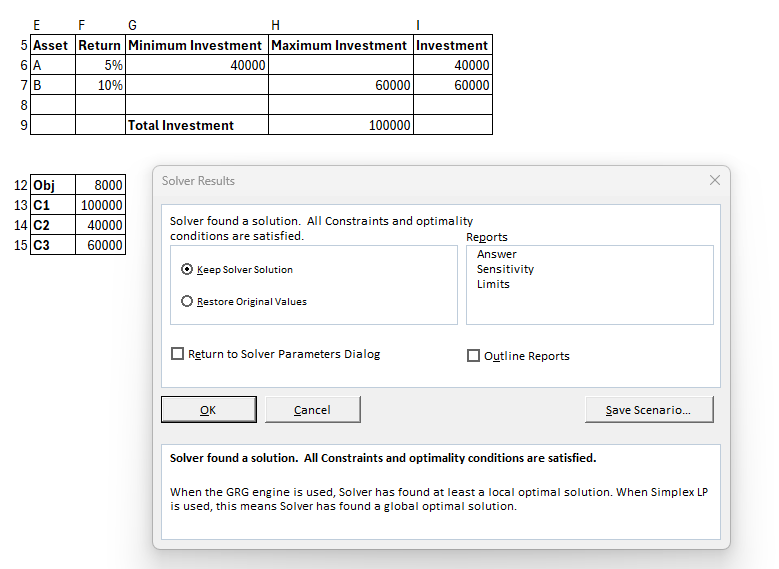

---
## Convex Optimization

- What if we also care about the risk of the investment?

- Volatility asset A: 2%
- Volatility asset B: 5%
- Correlation: 0.85
- Risk aversion: 1.0

---

## The new objective function:

$$
\text{Maximize } Z = 0.05x_1 + 0.10x_2 - \frac{1}{2} \times (0.02^2 \times x_1^2 + \frac{1}{2} \times 0.05^2 \times x_2^2 + 2 \times 0.02 \times 0.05 \times 0.85 \times x_1 \times x_2)
$$

---
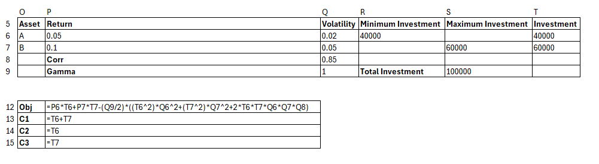

---
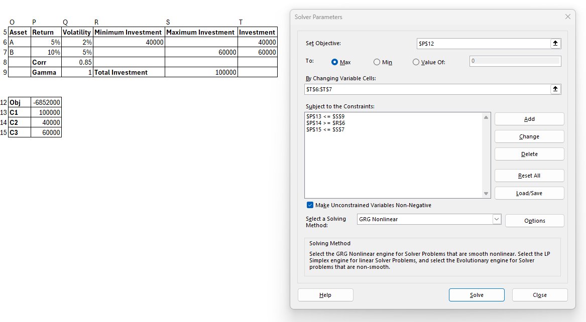

---
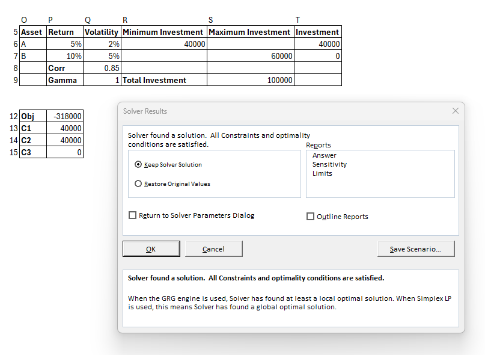

---
## MIP (Mixed-Integer Programming)

- Convex constraints are not enough to represent all real-world problems.
- Many problems require integer or binary decision variables. These variables can represent integer quantities or **binary** decisions that must be made during the optimization.

---

## First Example: Buying Shares

- You can only buy shares in whole numbers. (Although you can pool your money with others to buy a fraction of a share.)
- In the last example, assume company A's shares cost $10 and company B's shares cost $20. How would you modify the model?

---

$$
\text{Maximize } Z = 0.05\times 10 \times n_1 + 0.10\times 20 \times n_2
$$

Subject to:
$$
n_1\times 10 + n_2\times 20 \leq 100,000
$$

$$
n_2\times 20 \leq 60,000
$$
$$
n_1\times 10 \geq 40,000
$$
$$
n_1 \in \mathbb{N}_+, \quad n_2 \in \mathbb{N}_+
$$

---

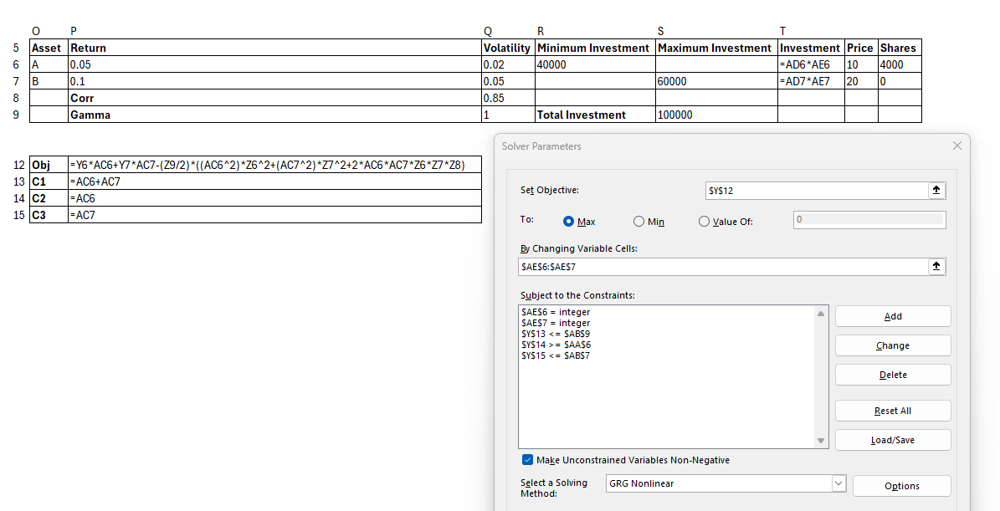

---

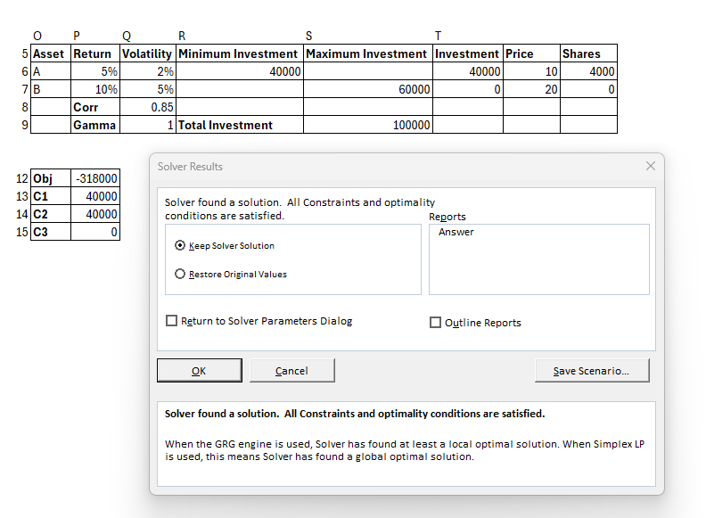


---

## Second Example: Binary Decision

- Binary decisions are often used in optimization problems where a decision must be made between two options.
- Example: You are a manufacturer and have two options for a new product line: Product A and Product B. You can only choose one of them. How would you model this in an optimization problem?

---

## The KnapSack Problem

- You have a knapsack with a weight limit of 15 kg.
- You have the following items to choose from: A, B, C, D, E, F.
- Each item has a weight and a utility value for you. 

E.g., A: 5 kg, 10 value.
B: 3 kg, 7 value.
C: 4 kg, 8 value.
D: 6 kg, 12 value.
E: 2 kg, 6 value.
F: 7 kg, 14 value.

---

## The KnapSack Problem

- You want to maximize the total value of the items you can carry in your knapsack without exceeding the weight limit.
- How would you model this as an optimization problem?
- Introduce binary decision variables $y_i$ for each item $i$.
$$
i \in \{A, B, C, D, E, F\} \quad y_i \in \{0, 1\}
$$

weights and utility
$$
w_i \quad \text{and} \quad v_i
$$

---

## Objective Function:

$$
\text{Maximize } Z = \sum_{i \in \{A, B, C, D, E, F\}} v_i \times y_i
$$

Subject to:

$$
\sum_{i \in \{A, B, C, D, E, F\}} w_i \times y_i \leq 15
$$

$$
y_i \in \{0, 1\}
$$


---

### Seat Assignment Problem

- You are organizing a wedding and have to assign seats to attendees. Some attendees have requested to sit next to each other, while others have requested to sit apart (restrictions).
- You think the wedding will be more enjoyable if people with similar interests sit together (preferences).

---

### Seat Assignment Problem

Attendees = $i=1,...,N$
Restrictions
$$
r_{ij} = \begin{cases} 1 & \text{if attendees } i \text{ and } j \text{ must sit together} \\ 0 & \text{otherwise} \end{cases}
$$
Preferences $p_{ij}$, the higher the value, the more fun the wedding will be if attendees $i$ and $j$ sit together.

---
### Tables, not everybody can sit together

- You have $M$ tables, each with a capacity of $C$.
- You want to assign attendees to tables in such a way that the total preference value is maximized.
- Decision variables: $x_{im} = 1$ if attendee $i$ is assigned to table $m$, $0$ otherwise.


---
### Respect the capacity of the tables

$$
\sum_{i=1}^{N} x_{im} \leq C \quad \forall m
$$

### Respect the restrictions

$$
 x_{im} + x_{jm} \geq 2\times r_{ij}\times x_{im} \quad \forall i,j,m
$$

$$
 x_{im} + x_{jm} \geq 2\times r_{ij}\times x_{jm} \quad \forall i,j,m
$$

---
### You can only assign one person to one table

$$
\sum_{m=1}^{M} x_{im} = 1 \quad \forall i
$$

---
### Objective Function

$$
\text{Maximize } Z = \sum_{i=1}^{N} \sum_{j=1}^{N}\sum_{m=1}^M p_{ij} \times x_{im} \times x_{jm}
$$

What is the problem? The objective function is not linear. We need to linearize it to make it simpler. 

---

### Linearization

- Introduce binary decision variables $y_{ijm}$ that are equal to 1 if attendees $i$ and $j$ are assigned to table $m$, 0 otherwise.

- The objective function becomes:

$$
\text{Maximize } Z = \sum_{i=1}^{N} \sum_{j=1}^{N} \sum_{m=1}^{M} p_{ij} \times y_{ijm}
$$

---

### Linking constraints

- The linking constraints ensure that $y_{ijm}$ is equal to 1 if attendees $i$ and $j$ are assigned to table $m$.

$$
y_{ijm} \geq x_{im} + x_{jm} - 1
$$

$$
y_{ijm} \leq x_{im}, \text{   }
y_{ijm} \leq x_{jm}
$$

---

### Full Model

$$
\begin{aligned}
\text{Maximize } Z = \sum_{i=1}^{N} \sum_{j=1}^{N} \sum_{m=1}^{M} p_{ij} \times y_{ijm} \\
\sum_{i=1}^{N} x_{im} \leq C \quad \forall m \\
x_{im} + x_{jm} \geq 2\times r_{ij} \quad \forall i,j,m \\
\sum_{m=1}^{M} x_{im} = 1 \quad \forall i \\
y_{ijm} \geq x_{im} + x_{jm} - 1 \quad \forall i,j,m \\
y_{ijm} \leq x_{im}, \text{   }
y_{ijm} \leq x_{jm} \quad \forall i,j,m \\
x_{im} \in \{0, 1\} \quad \forall i,m \\
y_{ijm} \in \{0, 1\} \quad \forall i,j,m
\end{aligned}
$$

---

## See attached Excel file for the modelling of the constraints. 

- Excel's solver is limited to 200 decision variables and 100 constraints. For larger problems, you can use Python to "pass" the problem to a solver. More on this in the following sessions (project overview).

---

## Using Solver with VBA

Consider the following problem:
$$
\begin{align*}
\max_{x_1,x_2} \quad 3x_1+2x_2 \\
\text{subject to} \quad x_1+x_2 &\leq 4 \\
x_1 - x_2 &\leq 1 \\
x_1,x_2 &\geq 0
\end{align*}
$$

---
### References to cells in Excel

- In cell `B1` you will input $x_1$. 
- In cell `B2` you will input $x_2$.
- In cell `B3` you will input the objective function ```=3*B1+2*B2```.
- In cell `B4` you will input the first constraint ```=B1+B2```.
- In cell `B5` you will input the second constraint ```=B1-B2```.

---
### Solve it in VBA

```vba
Sub SolveLinearProgram()

    ' Clear any previous solver settings
    SolverReset

    ' Set the objective: Maximize Z = 3*X1 + 2*X2 (which is in B3)
    SolverOk SetCell:=Range("B3"), MaxMinVal:=1, ValueOf:=0, ByChange:=Range("B1:B2")

    ' Add the constraints:
    ' X1 + X2 <= 4 (which is in B4)
    SolverAdd CellRef:=Range("B4"), Relation:=1, FormulaText:=4
    ' X1 - X2 <= 1 (which is in B5)
    SolverAdd CellRef:=Range("B5"), Relation:=1, FormulaText:=1
    ' X1 >= 0
    SolverAdd CellRef:=Range("B1"), Relation:=3, FormulaText:=0
    ' X2 >= 0
    SolverAdd CellRef:=Range("B2"), Relation:=3, FormulaText:=0

    ' Solve the problem
    SolverSolve UserFinish:=True

    ' Keep the Solver solution
    SolverFinish KeepFinal:=1

End Sub
```

---

### Explanation of the code

- `SolverReset`: Clears any existing solver settings.
-`SolverOk`: Sets the objective function in cell B3 (the formula for Z). The argument `MaxMinVal:=1` indicates that we are maximizing the objective.
`ByChange`: Refers to the decision variables $x_1$ and $x_2$ in the range `B1:B2`.
- `SolverAdd`: Adds constraints. For each constraint, we specify the cell reference, the type of relationship (Relation), and the target value (FormulaText). For example, `Relation:=1` corresponds to <=, and `Relation:=3` corresponds to >=.
- `SolverSolve`: Solves the linear program, and the argument `UserFinish:=True` means the solution will be completed without showing Solver's results dialog.
- `SolverFinish`: Keeps the solution in place after Solver completes.